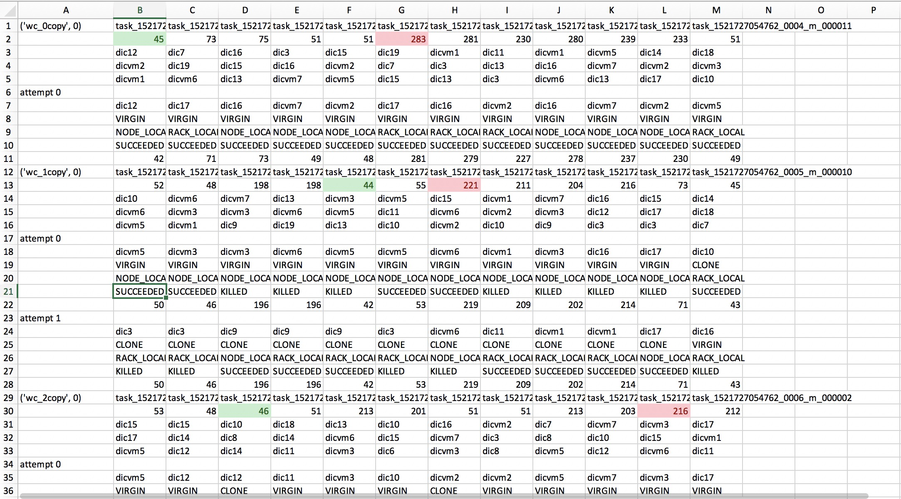

# JobHistory_Analysis

To evaluate the performance of different schedulers, we need to retrieve the and analyze the information of jobs.

## Usage

1. Run a set of experiments.

2. Retrieve the `.jhist` JobHistory files from HDFS
```
hdfsc dfs -get /tmp/hadoop-yarn/staging/history/done/2018/02/09/000000/*.jhist local_dir
```
The `2018/02/09` is the date your job is finished at. This command will download all the JobHistory files containing information of the testing jobs to local directory `local_dir`.

3. Under `local_dir`, run:
```
rename 's/^(.{22}).*(\..*)$/$1$2/' *
```
which renames each JobHistory file with only first 22 characters and the extension `.jhist`.

4. scp `local_dir` to your desktop, or run the script directly under `local_dir`.

## Scripts

`JobHistory_Analysis.py`: This script extracts in-depth information from JobHistory files, including:

- Job type
- Number of clones
- Detailed information of map attempts:
	* The nodes where stores the required input
	* The node where the attempt is running on
	* Is it original or a copy
	* Is it at node level or rack level
	* Final status (SUCCEEDED or KILLED)
	* Running time
	


`cycle.py`: This is a simplified script only analyzing elapsed time of single-type job.
